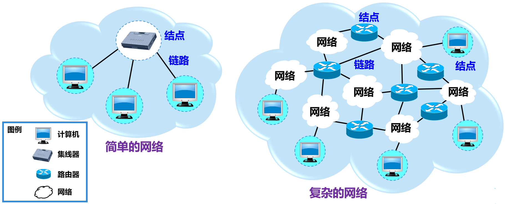
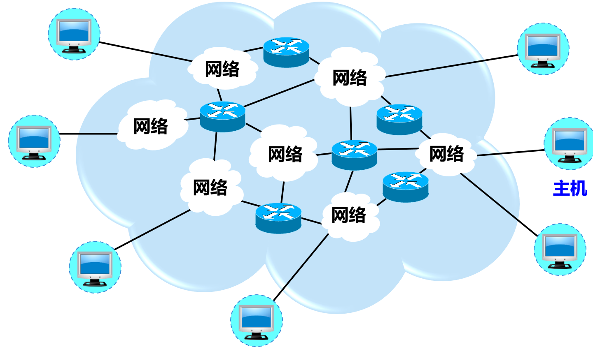

# 第1章	概述

本章重点内容：

- 互联网边缘部分和核心部分的作用，其中包含分组交换的概念；
- 计算机网络的性能指标；
- 计算机网络分层次的体系结构，包含协议和服务的概念。

## 1.1	计算机网络在信息时代中的作用

21世纪时一个**以网络为核心的信息时代**，包含**数字化**、**网络化**和**信息化**等重要特征。

“**三网融合**”指的是**电信网络**、有线电视网络和**计算机网络**。

## 1.2	互联网概述

**计算机网络**由若干**节点**（Node）和连接这些节点的**链路**（Link）组成。多个网络通过一些路由器相互连接起来，构成了一个覆盖范围更大的计算机网络，称为**互连网**。

习惯上，与网络相连的计算机通常称为主机（Host）。

