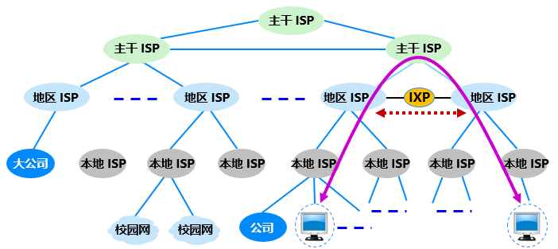

# 第1章	概述

本章重点内容：

- 互联网边缘部分和核心部分的作用，其中包含分组交换的概念；
- 计算机网络的性能指标；
- 计算机网络分层次的体系结构，包含协议和服务的概念。

## 1.1	计算机网络在信息时代中的作用

21世纪时一个**以网络为核心的信息时代**，包含**数字化**、**网络化**和**信息化**等重要特征。

“**三网融合**”指的是**电信网络**、有线电视网络和**计算机网络**。

## 1.2	互联网概述

**计算机网络**由若干**节点**（Node）和连接这些节点的**链路**（Link）组成。多个网络通过一些路由器相互连接起来，构成了一个覆盖范围更大的计算机网络，称为**互连网**。

习惯上，与网络相连的计算机通常称为主机（Host）。

互联网的基础结构大致经过**三个阶段**的演进：

**第一阶段**：从单个网络ARPANET向互连网发展；

注：任意把几个计算机网络互连起来，并能够相互通信，这样构成的是一个**互连网（internet）**，而不是**互联网（Internet）**。以**小写字母i开头的internet（互连网）是一个通用名词**，泛指由多个计算机网络互连而成的计算机网络；而**以大写字母I开头的Internet（互联网，或因特网）是一个专用名词**，它指当前全球最大的、开放的、由众多网络相互连接而成的特定互连网。

**第二阶段**：构建成了**三级结构的互联网**，分为**主干网**、**地区网**和**校园网（企业网）**。

**第三阶段**：逐渐形成全球范围的**多层次ISP（Internet Service Provider，互联网服务提供商）结构**的互联网。

根据提供服务的**覆盖面积大小**以及所**拥有的IP地址数目**的不同，ISP也分为不同层次的ISP：**主干ISP**、**地区ISP**和**本地ISP**。

**主干ISP**：由几个专门的公司创建和维护，服务面积最大（一般都能够覆盖国家范围）；

**地区ISP**：是一些较小的ISP，这些地区ISP通过一个或多个主干ISP连接起来；

**本地ISP**：给用户提供直接的服务，本地ISP可以连接到地区ISP，也可直接连接到主干ISP。

**互联网交换点IXP**：允许两个网络直接相连并交换分组，而不需要再通过第三个网络来转发分组。

制定互联网的正式标准要经过以下**三个阶段**：

（1）**互联网草案(Internet Draft)**——互联网草案的有效期只有六个月。在这个阶段还不能算是RFC文档。

（2）**建议标准(Proposed Standard)**——从这个阶段开始就成为RFC文档。

（3）**互联网标准(Internet Standard)**——如果经过长期的检验，证明了某个建议标准可以成为互联网标准时，就给它分配一个标准编号，记为STDxx，这里STD是“Standard”的英文缩写，而“xx”是标准的编号。

## 1.3	互联网的组成